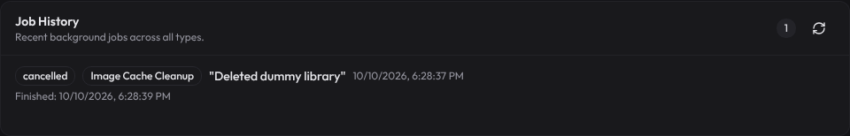
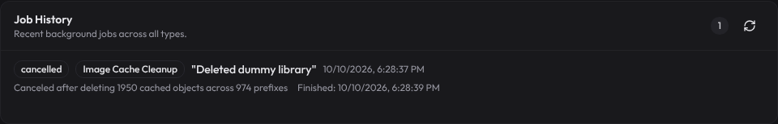
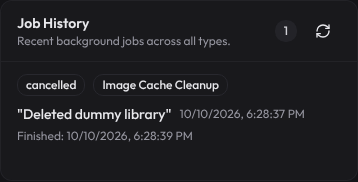
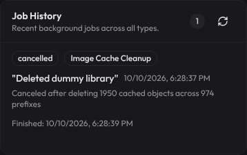

Web admin, Maintenance > Job History, same backend and same canceled cleanup job, only the web build differs. The job row was inserted with psql over dummy prefixes in the local artwork store, because a real one is only queued after deleting a library with cached artwork.

Cancel API, before (upstream/main): cancelable false, cancel returns 409 job_not_cancelable, job runs to succeeded. After: cancelable true, cancel returns 202 canceling, job ends canceled with deleted_prefixes 55860 of 60000.
