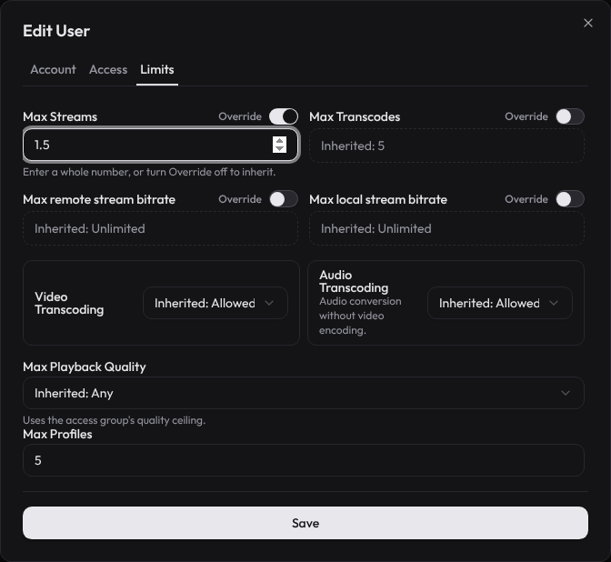
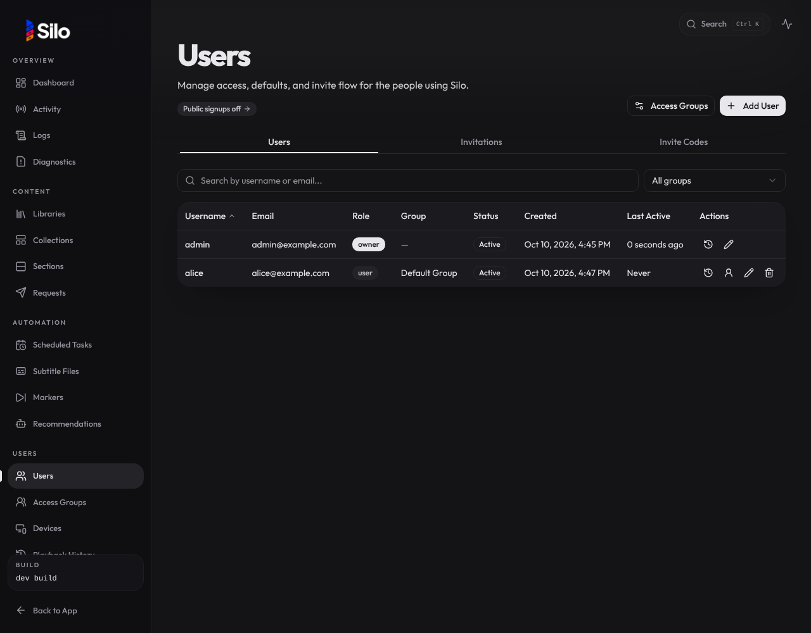
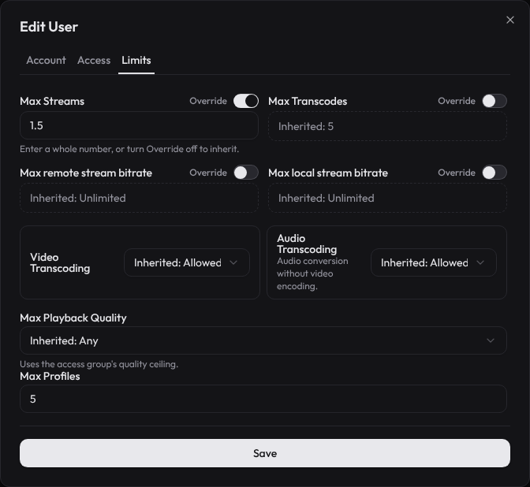
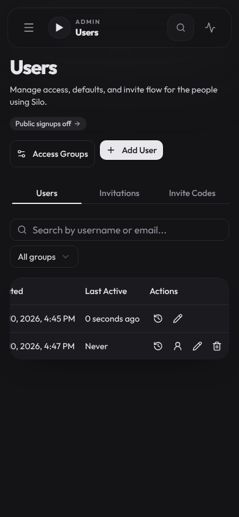
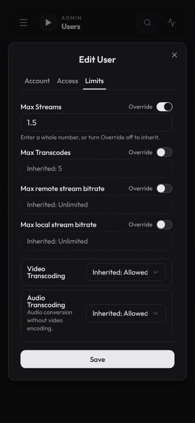

Web admin, Users > Edit User > Limits. Steps: turn on the Max Streams override, type 1.5, switch to the Account tab, press Save. Before, Save sent max_streams 1 (204) and the dialog closed. After, no request is sent and the dialog returns to Limits with 1.5 still in the field. Headless Chromium does not draw the native validation bubble.

